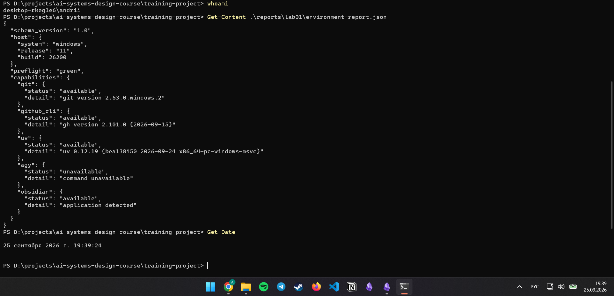
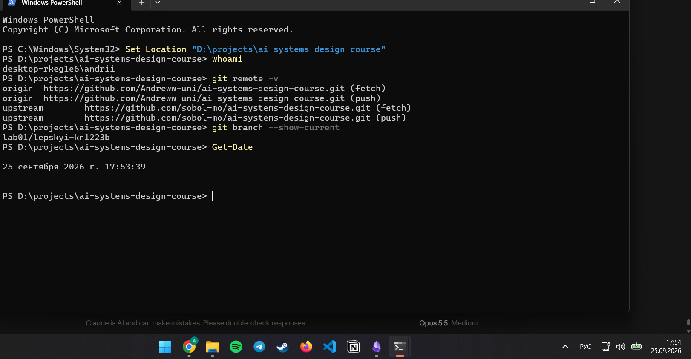
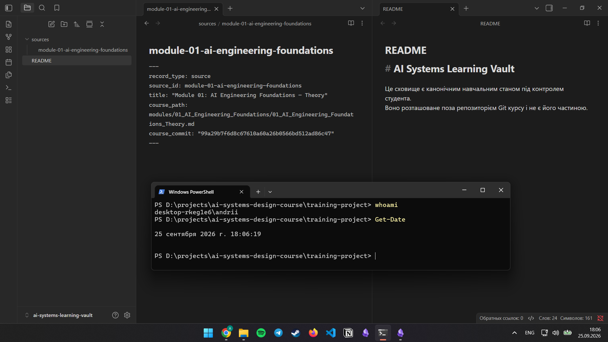
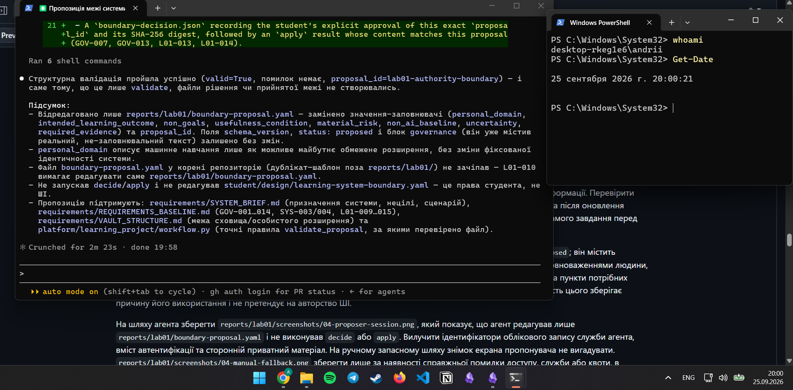
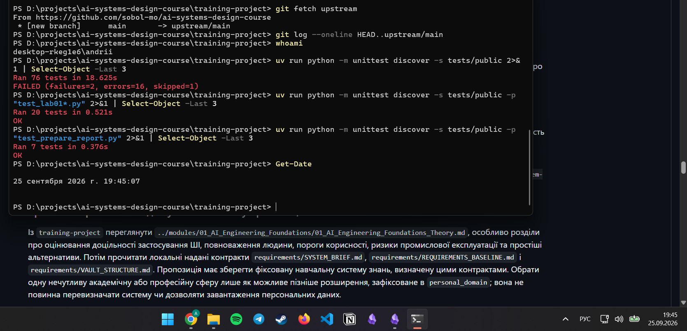
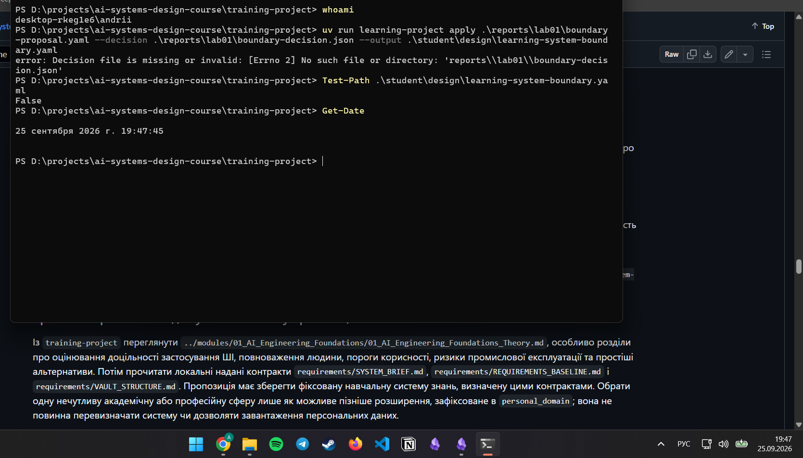
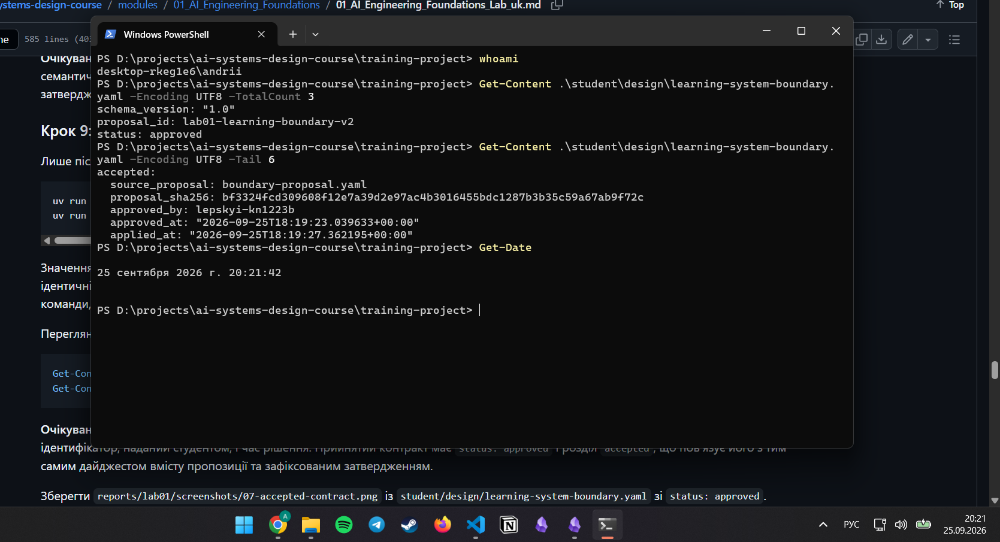

# Лабораторна робота 01

## Ідентифікація подання

- URL форку: https://github.com/Andreww-uni/ai-systems-design-course
- Назва гілки: lab01/lepskyi-kn1223b
- Повний хеш коміту: c6e7ed9207fcd7c52040dfd1ff45e7116af458f1

## Середовище

Робоча станція: Windows 11 25H2 (build 26200), PowerShell 5.1.26100.9444, WinGet 1.29.380. Git 2.53.0 уже був установлений до лабораторної роботи, тому початкове встановлення Git пропущено.

Перший запуск `winget configure` повідомив, що розширені можливості не ввімкнено. Я виконав `winget configure --enable` у тому самому журналі, після чого конфігурацію застосовано двічі. Обидва запуски завершилися повідомленням «Конфігурація застосована» для всіх п'яти елементів. Під час першого запуску модулі DSC завантажувалися з PSGallery, а під час другого використано вже локальні модулі. Другий запуск не перевстановив і не оновив пакунки: наприклад, Git залишився версії 2.53.0, хоча доступна 2.55.0.3. Це підтверджує збіжність.

Перевірені версії: GitHub CLI 2.101.0, uv 0.12.19 (новіша сумісна версія порівняно з перевіреною 0.12.9), Obsidian 1.13.7.

Перший запуск `learning-project doctor` дав `preflight: red`, бо Obsidian був установлений до лабораторної роботи в нестандартну теку `D:\Obsidian`, яку doctor не перевіряє. Я додав `D:\Obsidian` до користувацького `PATH`, після чого doctor повідомив `preflight: green` з чотирма доступними можливостями. Antigravity CLI позначено як недоступний, бо як пропонувача використано Claude Code.

Рисунок — `02-workstation-capabilities.png`

## Власність репозиторію

`origin` вказує на мій форк https://github.com/Andreww-uni/ai-systems-design-course, до якого я надсилаю зміни. `upstream` вказує на репозиторій курсу https://github.com/sobol-mo/ai-systems-design-course і використовується лише для отримання оновлень. Уся робота виконана на особистій гілці `lab01/lepskyi-kn1223b`, а не на `main`. Клон розташований у `D:\projects\ai-systems-design-course`. Коміти змінюють лише шляхи `training-project/student/` і `training-project/reports/`.

Рисунок — `01-git-remotes.png`

## Зовнішнє сховище Markdown-файлів

Розташування: external to repository — `D:\ai-systems-learning-vault`, поза клоном Git. Сховище містить `README.md` і `sources/module-01-ai-engineering-foundations.md` з `course_commit` 99a29b7f6d8c67610a60a26b0566bd512ad86c47. Тек `concepts/` та інших не створено. `git status` не показує сховище.

Обмеження: копії сховища поза пристроєм зараз немає, OneDrive не використовується. У разі втрати робочої станції вміст сховища буде втрачено.

Рисунок — `05-external-vault.png`

## Шлях пропонувача

Використано шлях агента: Claude Code 2.1.282 з наявною підпискою Claude Pro, 25.09.2026. Antigravity CLI не встановлювався.

Перший сеанс створив кандидата `lab01-authority-boundary`. Під час цього сеансу режим підтвердження дій було випадково перемкнено з ручного на автоматичний, і агент виконав 6 команд оболонки, зокрема структурну перевірку пропозиції. Команди `decide` і `apply` агент не виконував. Порівняння `git status --short -uall` до й після сеансу показало, що змінився лише `reports/lab01/boundary-proposal.yaml`, а файлу рішення та прийнятого контракту не з'явилося.

Після відхилення першого кандидата другий сеанс виконано в ручному режимі: агент за моїми зауваженнями відредагував лише `reports/lab01/boundary-proposal.yaml` (новий `proposal_id: lab01-learning-boundary-v2`) і не запускав жодних команд. Кожне редагування я переглядав і затверджував окремо.

Рисунок — `04-proposer-session.png`

## Семантичний розгляд

Кандидат `lab01-authority-boundary`, розгляд до запуску `decide`:

1. Так. Пропозиція зберігає надану навчальну систему знань, а машинне навчання вказано лише як можливе пізніше розширення.
2. Так. Результат описує спостережувану здатність студента, хоча сформульований вузько — лише для Лабораторної роботи 01.
3. Частково ні. Нецілі виключають пізніші можливості та повноваження ШІ, але явно не забороняють розширення до системи в промисловій експлуатації чи рішень із високими наслідками.
4. Так. ШІ лише пропонує, детермінований процес перевіряє структуру, студент затверджує.
5. Ні. Умова корисності описує аудит процесу, але не спирається на збережені свідчення джерел.
6. Так. Ризик застосування зміненої після розгляду пропозиції є правдоподібною відмовою процесу.
7. Ні. Базова лінія описує ручне написання файлу пропозиції, а не простішу альтернативу навчальному результату без ШІ.
8. Ні. Обидва пункти свідчень є детермінованими; немає пункту про людський семантичний розгляд або обґрунтування джерелами.
9. Так. Невизначеність чесно вказує, що неавтентифікована атрибуція та структурна перевірка можуть не виявити тонкої помилки.

Висновок: кандидата відхилено, бо відповіді на запитання 3, 5, 7 і 8 негативні.

Повторний розгляд кандидата `lab01-learning-boundary-v2` до запуску `decide`:

1. Так. Надану навчальну систему знань збережено, машинне навчання вказано лише як пізніше розширення.
2. Так. Результат описує спостережувану здатність студента.
3. Так. Додано неціль, що явно забороняє розширення до системи в промисловій експлуатації та рішення з високими наслідками.
4. Так. ШІ лише пропонує, детермінований процес перевіряє структуру й дайджест, студент затверджує.
5. Так. Умову корисності можна перевірити на записі джерела: `course_path` розв'язується на зафіксованому `course_commit`.
6. Так. Ризик застосування зміненої після розгляду пропозиції є правдоподібною відмовою процесу.
7. Так. Базова лінія без ШІ (читання теорії та ручні нотатки в Obsidian із посиланнями на джерело) простіша й закриває частину результату щодо простежуваності джерел.
8. Так. Свідчення охоплюють детерміновану перевірку та людський семантичний розгляд у REPORT.md.
9. Так. Невизначеність вказує, що структурна перевірка може не виявити тонкої помилки, а `recorded_by` не автентифікований.

Висновок: кандидата затверджено.

## Розподіл повноважень

ШІ може швидко зіставити надані контракти й запропонувати заповнення полів, але його текст може бути гладким і водночас неточним. Детермінований процес перевіряє лише структуру, прив'язує рішення до SHA-256 дайджесту точного вмісту та відмовляє в застосуванні без затвердження. Зміст оцінює тільки людина. У цій роботі це підтвердилося: перший кандидат пройшов `validate`, але під час семантичного розгляду я виявив чотири недоліки й відхилив його. Якби ШІ мав право затверджувати, слабка пропозиція стала б прийнятим контрактом.

## Корисність і базова лінія без ШІ

ШІ корисний тим, що швидко читає кілька контрактів, пов'язує поля пропозиції з конкретними вимогами (GOV, L01) і пропонує чернетку, яку людина потім перевіряє. Простіша базова лінія без ШІ — читати теорію модуля 01 і вести ручні нотатки в Obsidian із посиланням на `course_path` і `course_commit`. Вона вже закриває частину результату щодо простежуваності джерел, тому ШІ тут не є обов'язковим, а лише прискорює підготовку кандидата.

## Особиста предметна сфера як пізніше розширення

Обрано сферу «машинне навчання» як нечутливу академічну область. Вона зафіксована лише в `personal_domain` як можливе пізніше обмежене розширення: у майбутньому туди можна буде реєструвати джерела й поняття з машинного навчання за тим самим контрактом сховища — в тих самих теках за типом запису, з тегом на кшталт `domain/machine-learning`, без окремих тематичних тек. Ця сфера не змінює ідентичність системи, не дозволяє завантаження персональних даних і не додає нових вимог, тому навчальна система знань залишається тією самою.

## Проєктний компроміс

У прийнятій межі кандидата готує ШІ, а затверджує людина. Це пришвидшує підготовку пропозиції, але додає вартість і затримку людського розгляду: без нього структурно коректний, але змістовно слабкий кандидат пройшов би далі. Я прийняв цей компроміс, бо ризик прийняти неправильну межу важливіший за час розгляду. Переглянути рішення варто було б, якщо свідчення покажуть, що кандидати ШІ систематично не потребують виправлень або що розгляд займає непропорційно багато часу порівняно з ручною базовою лінією.

## Детерміновані перевірки

Повний набір публічних тестів (76 тестів) завершився результатом `FAILED (failures=2, errors=16, skipped=1)`. Усі 20 тестів Лабораторної роботи 01 і 7 тестів `prepare_report` проходять. Помилки стосуються лише тестів Лабораторної роботи 02: фрагменти джерел отримують подвоєні порожні рядки, і перевірка SHA-256 не збігається, що вказує на проблему закінчень рядків CRLF на Windows. Спочатку помилок було 26; після `git config core.autocrlf false` для репозиторію та повторного вивантаження файлів їх стало 16. Оновлень в `upstream/main` немає, проблему повідомлено викладачу. Крім того, `git diff --check` повідомляє про пробіли в кінці рядків у `boundary-decision.json`: це символи CRLF, які команда `decide` записує на Windows. Файл рішення не можна редагувати вручну, тому я залишив його без змін.

Передчасний `apply` без файлу рішення завершився помилкою, а `student/design/learning-system-boundary.yaml` не було створено. Після затвердження `lab01-learning-boundary-v2` команда `apply` створила прийнятий контракт зі `status: approved`. Дайджест у рішенні (`bf3324fc…f72c`) збігся з незалежно обчисленим `Get-FileHash`.

Успішний валідатор не доводить, що пропозиція є добрим проєктом: він перевіряє лише наявність і формат полів. Перший кандидат `lab01-authority-boundary` пройшов `validate`, але мав змістовні недоліки й був відхилений під час семантичного розгляду.

Рисунок — `03-public-tests.png`

Рисунок — `06-premature-apply-refused.png`

Рисунок — `07-accepted-contract.png`

## Відновлення

Відтворюване середовище відновлюється повторним застосуванням `fixtures/windows/lab01-workstation-windows11.dsc.yaml` через `winget configure` і командою `uv sync`, яка відбудовує `.venv` з `uv.lock`. Артефакти проєкту в Git відновлюються клонуванням мого форку й перемиканням на гілку `lab01/lepskyi-kn1223b`. Змінне сховище Markdown-файлів з Git не відновлюється; зараз воно зберігається лише на локальному диску `D:` без копії поза пристроєм, тому його втрата можлива. Найпростішим наступним кроком було б перенести сховище в теку OneDrive.
